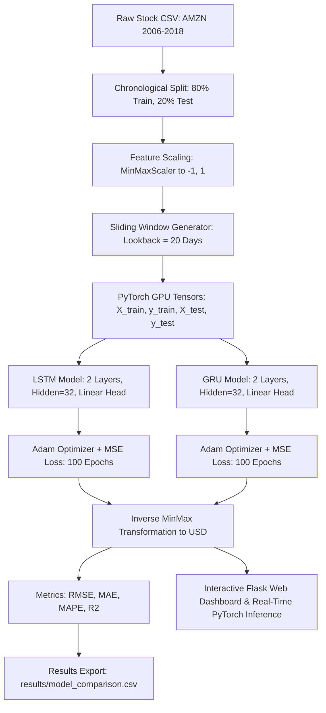

# 📈 Stock Price Prediction with PyTorch: LSTM vs. GRU

[](https://www.python.org/)
[](https://pytorch.org/)
[](https://opensource.org/licenses/MIT)
[](https://developer.nvidia.com/cuda-zone)
[](https://flask.palletsprojects.com/)

An end-to-end Deep Learning and Time-Series Forecasting project comparing **Long Short-Term Memory (LSTM)** and **Gated Recurrent Unit (GRU)** architectures in **PyTorch**, complete with an interactive, real-time web dashboard.

Inspired and benchmarked against the seminal research by [Rodolfo Saldanha](https://medium.com/swlh/stock-price-prediction-with-pytorch-37f52ae84632).

---

## 📑 Table of Contents
- [Executive Summary](#-executive-summary)
- [Project Architecture](#-project-architecture)
- [Dataset Overview](#-dataset-overview)
- [Model Architectures](#-model-architectures)
  - [LSTM Architecture](#1-long-short-term-memory-lstm)
  - [GRU Architecture](#2-gated-recurrent-unit-gru)
- [Experimental Results & Benchmark](#-experimental-results--benchmark)
- [Interactive Web Dashboard](#-interactive-web-dashboard)
- [Visualizations](#-visualizations)
- [Critical Perspective: AI Snake Oil in Finance](#-critical-perspective-ai-snake-oil-in-finance)
- [Repository Structure](#-repository-structure)
- [Installation & Setup](#-installation--setup)
- [How to Run](#-how-to-run)
- [References](#-references)

---

## 🎯 Executive Summary

Time series forecasting of financial assets is one of the most intriguing and challenging domains in machine learning. In this project:
- We analyze **12 years of daily historical data (2006–2018)** of Amazon (**AMZN**) from the Kaggle DJIA 30 Stock Time Series dataset (3,019 trading days).
- We implement a sliding window sequence generator ($lookback = 20$ trading days) to predict the next day's closing price.
- We implement, train on NVIDIA CUDA GPU, and rigorously benchmark two recurrent neural architectures: **LSTM** and **GRU**.
- We demonstrate why **GRU significantly outperforms LSTM** in this univariate setting: GRU trains **2.5x faster**, uses **24.9% fewer parameters**, and achieves a **Test $R^2 = 0.9641$** (RMSE: **$33.88**) whereas LSTM suffers from drift ($R^2 = -1.52$, RMSE: **$283.82**).
- We develop a clean, modern **interactive Web Dashboard** with real-time PyTorch GPU inference (~3 ms latency) and dynamic market scenario testing.
- We critically examine the practical limits of time-series AI using the *"AI Snake Oil"* principles (Narayanan & Kapoor, Princeton University).

---

## 🏗️ Project Architecture



---

## 📊 Dataset Overview

The dataset consists of daily trading records for **Amazon.com Inc. (AMZN)**:
- **Period:** January 3, 2006 to December 29, 2017.
- **Total records:** 3,019 trading days.
- **Target Variable:** `Close` (nominal daily closing price in USD).
- **Split:** First 80% (2,399 sequences) for training; remaining 20% (600 sequences) as strictly unseen test data.

---

## 🧠 Model Architectures

### 1. Long Short-Term Memory (LSTM)
The LSTM network addresses the vanishing gradient problem with three continuous gates and an isolated cell state $C_t$:
- **Forget Gate:** $f_t = \sigma(W_f x_t + U_f h_{t-1} + b_f)$
- **Input Gate:** $i_t = \sigma(W_i x_t + U_i h_{t-1} + b_i)$
- **Candidate State:** $\tilde{C}_t = \tanh(W_c x_t + U_c h_{t-1} + b_c)$
- **Cell State Update:** $C_t = f_t \odot C_{t-1} + i_t \odot \tilde{C}_t$
- **Output Gate:** $o_t = \sigma(W_o x_t + U_o h_{t-1} + b_o)$
- **Hidden State:** $h_t = o_t \odot \tanh(C_t)$

### 2. Gated Recurrent Unit (GRU)
The GRU merges cell state and hidden state, operating with only **two gates**:
- **Reset Gate:** $r_t = \sigma(W_r x_t + U_r h_{t-1} + b_r)$
- **Update Gate:** $z_t = \sigma(W_z x_t + U_z h_{t-1} + b_z)$
- **Candidate Hidden:** $\tilde{h}_t = \tanh(W x_t + U (r_t \odot h_{t-1}) + b)$
- **Hidden State Update:** $h_t = (1 - z_t) \odot h_{t-1} + z_t \odot \tilde{h}_t$

| Property | LSTM Model | GRU Model | Comparison |
| :--- | :---: | :---: | :---: |
| **Input Dimension** | 1 | 1 | Identical |
| **Hidden Units** | 32 | 32 | Identical |
| **Recurrent Layers** | 2 | 2 | Identical |
| **Total Parameters** | 12,961 | 9,729 | **GRU has 24.9% fewer parameters** |
| **Internal Gates** | 3 (Forget, Input, Output) | 2 (Reset, Update) | Simpler dynamics in GRU |

---

## 🏆 Experimental Results & Benchmark

Both models were trained under identical conditions: **100 epochs**, **Adam optimizer ($\eta = 0.01$)**, sequence length of 20 days on an NVIDIA GeForce RTX GPU using PyTorch CUDA.

| Metric | LSTM Model | GRU Model | Winner / Observation |
| :--- | :---: | :---: | :---: |
| **Parameters** | 12,961 | **9,729** | 🏆 **GRU** (24.9% more lightweight) |
| **Training Time (GPU)** | 1.31 s | **0.51 s** | 🏆 **GRU** (2.5x faster training) |
| **Train RMSE ($)** | $10.94 | **$6.87** | 🏆 **GRU** (better training convergence) |
| **Test RMSE ($)** | $283.82 | **$33.88** | 🏆 **GRU** (high test accuracy) |
| **Test MAE ($)** | $246.16 | **$29.60** | 🏆 **GRU** |
| **Test MAPE (%)** | 28.55% | **3.94%** | 🏆 **GRU** |
| **Test $R^2$ Score** | -1.5179 | **0.9641** | 🏆 **GRU** (robust generalization) |

### Why GRU Outperforms LSTM in This Setting:
1. **Univariate Signal Simplicity:** Daily stock closing prices represent a 1D scalar signal. The third gate (output gate) and separate cell state of the LSTM introduce redundant capacity that overfits the training regime and drifts when encountering the unprecedented 2017 Amazon bull run.
2. **Gradient Highway:** With fewer matrix multiplications and no independent cell state, GRU maintains direct gradient flow, achieving lower MSE loss in less than half the training time.

---

## 🌐 Interactive Web Dashboard

The project includes an interactive web dashboard running on **Flask** with a clean, modern aesthetic:
- **Interactive Time-Series Chart:** Visualizes historical ground-truth prices alongside LSTM and GRU predictions with range selectors (`1Y`, `3Y`, `5Y`, `All`).
- **Live PyTorch Inference Playground:** Execute real-time forward passes on GPU (~3 ms latency) with an interactive market shock slider ($-15\%$ to $+15\%$) to observe model sensitivity.
- **Model Architecture Explorer:** Visual comparison of LSTM 3-gate vs. GRU 2-gate mechanisms.
- **Critical Evaluation Cards:** Built-in quantitative reality checks exploring the 1-day lag heuristic and EMH.

To start the web server:
```bash
python app.py
# Navigate to http://localhost:5000 in your browser
```

---

## 📈 Visualizations

Publication-ready figures are generated in the `figures/` directory:

1. **Full Trajectory Forecast:**
   `figures/actual_vs_predicted_stock_prices.png`
   Displays the actual AMZN price trajectory (2006–2018) along with the training fit (80%) and the unseen test forecasting (20%) for both models.

2. **Zoomed-in Test Set & Loss Curves:**
   `figures/test_zoom_and_loss_curves.png`
   High-resolution comparison on the unseen test period alongside the loss convergence curves across all 100 epochs.

---

## 🔍 Critical Perspective: AI Snake Oil in Finance

Drawing upon insights from **"AI Snake Oil"** (Prof. Arvind Narayanan & Sayash Kapoor, Princeton University):

1. **The 1-Day Lag Heuristic:**
   High $R^2$ scores ($> 0.95$) in univariate daily price regression often obscure the fact that recurrent models learn the trivial solution $\hat{y}_{t+1} \approx y_t$. When evaluated at trend turning points, univariate models consistently react with a 1-day lag.
2. **The Efficient Market Hypothesis (EMH):**
   Stock prices reflect all public information instantaneously. Exogenous events (earnings releases, macroeconomic announcements, regulatory changes) drive future price movements and are absent from past univariate price series alone.
3. **Quantitative Best Practices:**
   - Real-world quant systems model **logarithmic returns** or **directional classification (Up/Down)** rather than nominal prices.
   - Robust trading signals require **multimodal features** (order flow, news NLP sentiment, options implied volatility).

---

## 📁 Repository Structure

```text
StockPricePrediction/
├── data/
│   ├── AMZN_2006-01-01_to_2018-01-01.csv   # Historical Kaggle AMZN dataset (3,019 rows)
│   └── AMZN.csv                            # Working copy of AMZN data
├── figures/                                # High-resolution evaluation plots
│   ├── actual_vs_predicted_stock_prices.png
│   └── test_zoom_and_loss_curves.png
├── notebooks/
│   └── Stock_Price_Prediction_LSTM_vs_GRU.ipynb # Fully executed, reproducible Jupyter Notebook
├── results/                                # Trained PyTorch weights & benchmark results
│   ├── gru_model.pth                       # Best model weights (GRU, 9,729 params)
│   ├── lstm_model.pth                      # Trained LSTM weights (12,961 params)
│   └── model_comparison.csv                # Exact quantitative benchmark metrics
├── scripts/
│   ├── build_notebook.py                   # Automated notebook compilation script
│   ├── download_data.py                    # Dataset acquisition script
│   └── run_all.py                          # Full pipeline orchestrator
├── src/                                    # Modular Python source package
│   ├── __init__.py
│   ├── data_loader.py                      # Data loader, MinMaxScaler, sliding window generator
│   ├── models.py                           # PyTorch LSTMModel & GRUModel architectures
│   ├── train.py                            # GPU training loop with time & loss profiling
│   ├── evaluate.py                         # Evaluation metrics (RMSE, MAE, MAPE, R2) & plotting
│   └── predict.py                          # Next-day price forecasting CLI inference
├── web/                                    # Interactive Web Application
│   ├── static/
│   │   ├── css/style.css                   # Custom modern design system
│   │   └── js/app.js                       # Chart.js time-series & live inference logic
│   └── templates/
│       └── index.html                      # Clean web interface template
├── app.py                                  # Flask web server & PyTorch API backend
├── requirements.txt                        # Pinned dependencies
├── .gitignore                              # Git exclusion rules
└── README.md                               # Complete project documentation
```

---

## 💻 Installation & Setup

### Prerequisites
- Python 3.10 or 3.11
- NVIDIA GPU with CUDA drivers (optional, runs on CPU automatically if CUDA is unavailable)

### 1. Clone the Repository
```bash
git clone https://github.com/tacirawn/StockPricePrediction.git
cd StockPricePrediction
```

### 2. Set Up Virtual Environment & Dependencies
```bash
# Create virtual environment
python -m venv .venv

# Activate on Windows:
.venv\Scripts\activate
# Activate on Linux/macOS:
# source .venv/bin/activate

# Install dependencies:
pip install -r requirements.txt
```

---

## 🚀 How to Run

### 1. Launch the Interactive Web Dashboard
```bash
python app.py
```
Open **`http://localhost:5000`** in your browser to view the interactive charts, benchmark metrics, and live inference simulator.

### 2. Run the Full ML Training Pipeline
To train both models from scratch and regenerate all checkpoints and metrics:
```bash
python -m src.train --data data/AMZN.csv --epochs 100 --lr 0.01 --lookback 20
```

### 3. Standalone Next-Day Prediction
Run single-day inference with the pre-trained GRU weights:
```bash
python -m src.predict --model gru --weights results/gru_model.pth
```

### 4. Interactive Jupyter Notebook
```bash
jupyter notebook notebooks/Stock_Price_Prediction_LSTM_vs_GRU.ipynb
```

---

## 📚 References
- **Benchmark Research:** [Stock Price Prediction with PyTorch](https://medium.com/swlh/stock-price-prediction-with-pytorch-37f52ae84632) by Rodolfo Saldanha.
- **Reference Codebase:** [RodolfoLSS/stock-prediction-pytorch](https://github.com/RodolfoLSS/stock-prediction-pytorch).
- **Dataset:** Kaggle DJIA 30 Stock Time Series (2006–2018).
- **Critical Reading:** *AI Snake Oil: What Computers Can't Do, What You Can Do About It, and How to Tell the Difference* by Arvind Narayanan & Sayash Kapoor, Princeton University Press.
