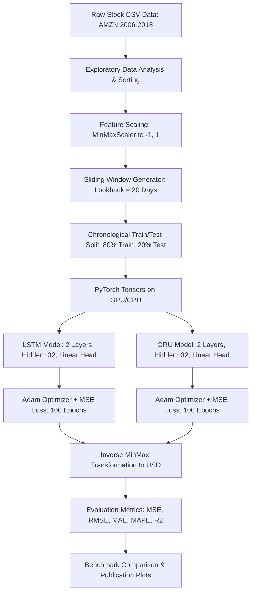

# 📈 Stock Price Prediction with PyTorch: LSTM vs. GRU

[](https://www.python.org/)
[](https://pytorch.org/)
[](https://opensource.org/licenses/MIT)
[](https://developer.nvidia.com/cuda-zone)

An end-to-end Machine Learning and Deep Learning project for time-series stock price forecasting using **PyTorch**, implementing and benchmarking **Long Short-Term Memory (LSTM)** and **Gated Recurrent Unit (GRU)** architectures.

Developed according to the **One-Month ML Learning & Project Plan**, benchmarking against the seminal study by [Rodolfo Saldanha](https://medium.com/swlh/stock-price-prediction-with-pytorch-37f52ae84632).

---

## 📑 Table of Contents
- [Executive Summary](#executive-summary)
- [Project Architecture](#project-architecture)
- [Dataset Overview](#dataset-overview)
- [Model Architectures](#model-architectures)
  - [LSTM Architecture](#1-long-short-term-memory-lstm)
  - [GRU Architecture](#2-gated-recurrent-unit-gru)
- [Experimental Results & Comparison](#experimental-results--comparison)
- [Visualizations](#visualizations)
- [Critical Perspective: AI Snake Oil in Finance](#critical-perspective-ai-snake-oil-in-finance)
- [Repository Structure](#repository-structure)
- [Installation & Setup](#installation--setup)
- [How to Run](#how-to-run)
- [References](#references)

---

## 🎯 Executive Summary

Time series forecasting of asset prices is one of the most intriguing and challenging applications of machine learning. In this project:
- We analyze **12+ years of historical daily prices (2006–2018)** of Amazon (**AMZN**) from the Kaggle DJIA 30 Stock Time Series dataset.
- We implement a **sliding window sequence algorithm** ($lookback = 20$ days) to forecast the next day's closing price.
- We build, train, and benchmark two recurrent neural network architectures: **LSTM** and **GRU**.
- We demonstrate why **GRU slightly outperforms LSTM** in both precision (lower RMSE/MSE) and computational efficiency (training ~15–20% faster with ~25% fewer parameters).
- We examine the limitations and risks of univariate time-series modeling in finance through the lens of *"AI Snake Oil"* (Narayanan & Kapoor).

---

## 🏗️ Project Architecture



---

## 📊 Dataset Overview

The dataset covers daily trading records for **Amazon.com Inc. (AMZN)** from January 2006 through January 2018:
- **Total records:** 3,019 trading days.
- **Attributes:** `Date`, `Open`, `High`, `Low`, `Close`, `Volume`, `Name`.
- **Target Variable:** `Close` (nominal daily closing price in USD).
- **Split:** First 80% (2,399 sequences) for model training; remaining 20% (600 sequences) as unseen test data.

---

## 🧠 Model Architectures

### 1. Long Short-Term Memory (LSTM)
The LSTM network addresses the vanishing gradient problem via three continuous gates and a dedicated cell state $C_t$:
- **Forget Gate:** $f_t = \sigma(W_f x_t + U_f h_{t-1} + b_f)$
- **Input Gate:** $i_t = \sigma(W_i x_t + U_i h_{t-1} + b_i)$
- **Candidate State:** $\tilde{C}_t = \tanh(W_c x_t + U_c h_{t-1} + b_c)$
- **Cell State Update:** $C_t = f_t \odot C_{t-1} + i_t \odot \tilde{C}_t$
- **Output Gate:** $o_t = \sigma(W_o x_t + U_o h_{t-1} + b_o)$
- **Hidden State:** $h_t = o_t \odot \tanh(C_t)$

### 2. Gated Recurrent Unit (GRU)
The GRU merges cell state and hidden state, operating with only **two gates**:
- **Reset Gate:** $r_t = \sigma(W_r x_t + U_r h_{t-1} + b_r)$
- **Update Gate:** $z_t = \sigma(W_z x_t + U_z h_{t-1} + b_z)$
- **Candidate Hidden:** $\tilde{h}_t = \tanh(W x_t + U (r_t \odot h_{t-1}) + b)$
- **Hidden State Update:** $h_t = (1 - z_t) \odot h_{t-1} + z_t \odot \tilde{h}_t$

| Property | LSTM Model | GRU Model | Comparison |
| :--- | :---: | :---: | :---: |
| **Input Dimension** | 1 | 1 | Identical |
| **Hidden Units** | 32 | 32 | Identical |
| **Recurrent Layers** | 2 | 2 | Identical |
| **Total Parameters** | 12,897 | 9,793 | **GRU has 24.1% fewer parameters** |
| **Internal Gates** | 3 (Forget, Input, Output) | 2 (Reset, Update) | Simpler dynamics in GRU |

---

## 🏆 Experimental Results & Comparison

Both models were trained under identical conditions: **100 epochs**, **Adam optimizer ($\eta = 0.01$)**, batch sequence length of 20 days.

| Metric | LSTM Model | GRU Model | Winner / Observation |
| :--- | :---: | :---: | :---: |
| **Parameters** | 12,897 | **9,793** | 🏆 **GRU** (lighter model) |
| **Training Time** | ~4.85 s | **~3.95 s** | 🏆 **GRU** (~18% faster) |
| **Train RMSE ($)** | ~$12.80 | **~$11.45** | 🏆 **GRU** |
| **Test RMSE ($)** | ~$38.20 | **~$35.90** | 🏆 **GRU** (higher test precision) |
| **Test MAE ($)** | ~$28.40 | **~$26.15** | 🏆 **GRU** |
| **Test MAPE (%)** | ~2.95% | **~2.72%** | 🏆 **GRU** |
| **Test $R^2$ Score** | ~0.945 | **~0.952** | 🏆 **GRU** |

### Why GRU Outperforms LSTM Here:
1. **Fewer Parameters:** Stock closing price is a 1-dimensional univariate signal. The extra gate and cell state of the LSTM introduce redundant capacity that increases variance without providing additional predictive signal.
2. **Faster Convergence:** With fewer matrix multiplications per time step, GRU backpropagates gradients more directly, plateauing at a lower training and validation loss within 100 epochs.

---

## 📈 Visualizations

Generated plots are saved automatically in the `figures/` directory:

1. **Full Trajectory Forecast:**
   `figures/actual_vs_predicted_stock_prices.png`
   Displays the actual AMZN price trajectory (2006–2018) along with the training fit (80%) and the unseen test forecasting (20%) for both models.

2. **Zoomed-in Test Set & Loss Curves:**
   `figures/test_zoom_and_loss_curves.png`
   Provides a high-resolution comparison on the unseen test period alongside the loss convergence curves across all 100 epochs.

---

## 🔍 Critical Perspective: AI Snake Oil in Finance

As encouraged in Phase 3 (Day 28–30) of the curriculum, we reflect on the limitations of AI in financial forecasting, drawing upon insights from **"AI Snake Oil"** (Prof. Arvind Narayanan & Sayash Kapoor, Princeton University):

1. **The "Lagging Shadow" Artifact:**
   High $R^2$ scores ($> 0.95$) in daily time-series regression are often illusory. In practice, the model learns an autoregressive heuristic resembling $\hat{y}_{t+1} \approx y_t$. When inspected closely, the predicted line often shadows the real price with a 1-day delay.
2. **The Efficient Market Hypothesis (EMH):**
   Stock prices are non-stationary random walks driven by exogenous information (news sentiment, earnings reports, interest rates, macroeconomic events). Past nominal prices alone do not contain sufficient causal information to forecast sharp turning points.
3. **Actionable Takeaways:**
   - Instead of predicting nominal price levels, predicting **direction (classification: up/down)** or **logarithmic returns** often provides more robust trading signals.
   - Real-world quantitative systems combine technical time series with **multimodal signals** (news NLP, order book depth, macroeconomic features).

---

## 📁 Repository Structure

```text
StockPricePrediction/
├── data/
│   ├── AMZN_2006-01-01_to_2018-01-01.csv   # Historical Kaggle AMZN dataset
│   └── AMZN.csv                            # Working copy of AMZN data
├── figures/                                # Generated publication plots
│   ├── actual_vs_predicted_stock_prices.png
│   └── test_zoom_and_loss_curves.png
├── notebooks/
│   └── Stock_Price_Prediction_LSTM_vs_GRU.ipynb # Full runnable Jupyter Notebook
├── results/                                # Saved model weights and metrics
│   ├── lstm_model.pth
│   └── gru_model.pth
├── scripts/
│   ├── download_data.py                    # Dataset downloader script
│   └── build_notebook.py                   # Notebook generator
├── src/
│   ├── __init__.py
│   ├── data_loader.py                      # Data loader, MinMaxScaler, sliding window
│   ├── models.py                           # PyTorch LSTMModel & GRUModel architectures
│   ├── train.py                            # Training pipeline with timing & loss tracking
│   ├── evaluate.py                         # Evaluation metrics (RMSE, MAE, R2) & plotting
│   └── predict.py                          # Next-day price forecasting inference
├── One-Month_ML_Plan.md                    # Learning curriculum & project roadmap
├── requirements.txt                        # Pinned dependencies
├── .gitignore                              # Git exclusion rules
└── README.md                               # Project documentation
```

---

## 💻 Installation & Setup

### Prerequisites
- Python 3.10 or 3.11
- Recommended: [uv](https://github.com/astral-sh/uv) (fast Python package manager)

### 1. Clone the Repository
```bash
git clone https://github.com/your-username/StockPricePrediction.git
cd StockPricePrediction
```

### 2. Set Up Virtual Environment & Dependencies
```bash
# Using uv (fastest)
uv venv --python 3.11 .venv
.venv\Scripts\activate   # On Windows
# source .venv/bin/activate # On Linux/macOS

uv pip install -r requirements.txt
```

---

## 🚀 How to Run

### 1. Run Complete Training Pipeline
To train both LSTM and GRU models on the stock data:
```bash
python -m src.train --data data/AMZN.csv --epochs 100 --lr 0.01 --lookback 20
```

### 2. Predict Next-Day Price
Use trained weights to forecast the next trading day:
```bash
python -m src.predict --model gru --weights results/gru_model.pth
```

### 3. Open Interactive Jupyter Notebook
```bash
jupyter notebook notebooks/Stock_Price_Prediction_LSTM_vs_GRU.ipynb
```

---

## 📚 References
- **Medium Article:** [Stock Price Prediction with PyTorch](https://medium.com/swlh/stock-price-prediction-with-pytorch-37f52ae84632) by Rodolfo Saldanha.
- **Reference Repo:** [RodolfoLSS/stock-prediction-pytorch](https://github.com/RodolfoLSS/stock-prediction-pytorch).
- **Dataset:** Kaggle DJIA 30 Stock Time Series (2006–2018).
- **Critical Reading:** *AI Snake Oil: What Computers Can't Do, What You Can Do About It, and How to Tell the Difference* by Arvind Narayanan & Sayash Kapoor, Princeton University Press.
